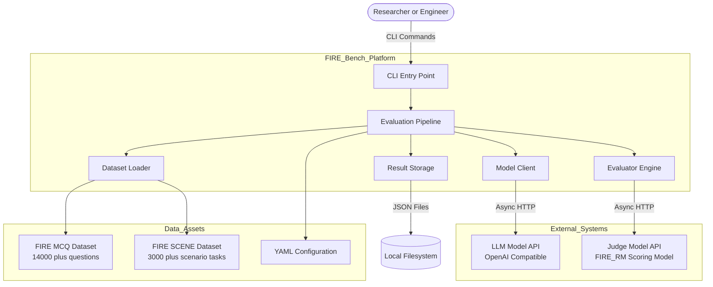
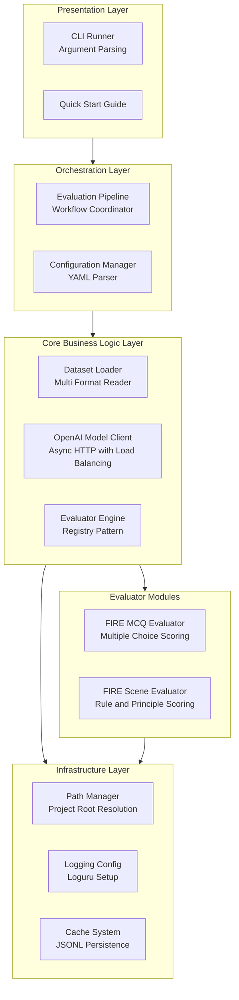
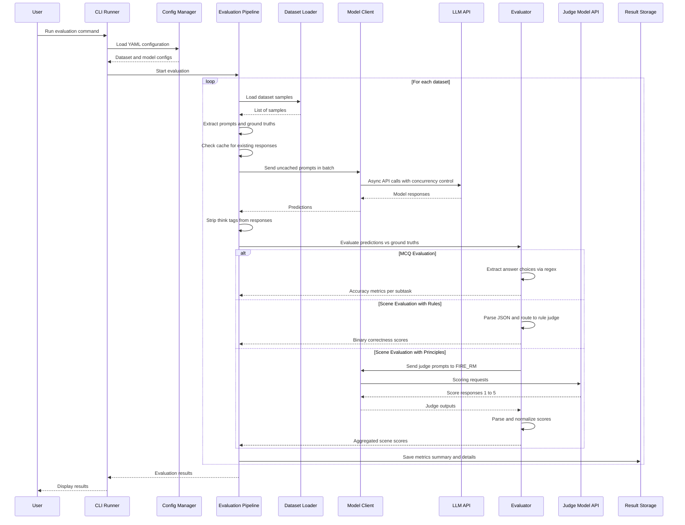
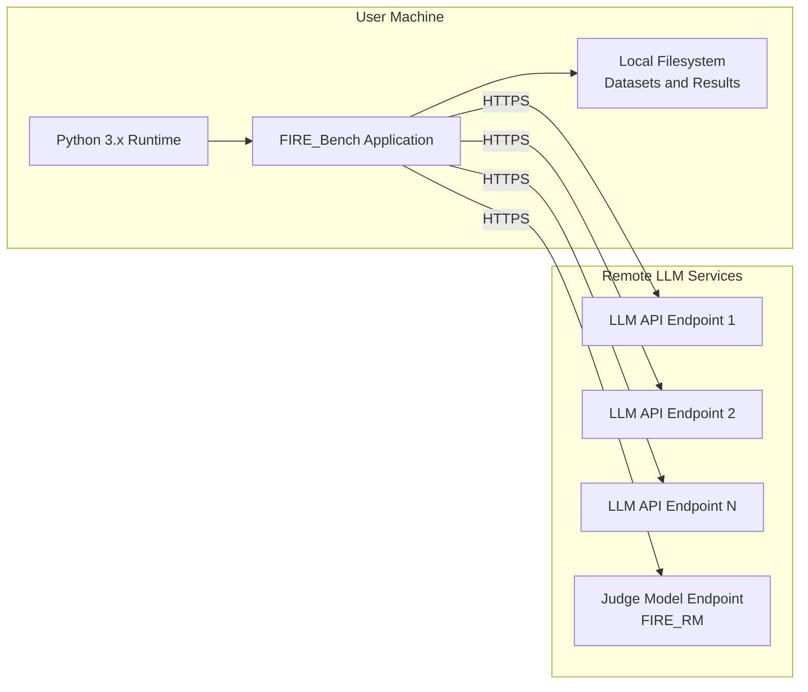

# High-Level Design (HLD) — FIRE-Bench Evaluation Platform

## 1. Executive Summary

**FIRE-Bench** (Financial Intelligence and Reasoning Evaluation) is an automated benchmarking platform designed to evaluate the financial reasoning capabilities of Large Language Models (LLMs). Built as a collaboration between Duxiaoman Technology (Beijing), Tsinghua University PBC School of Finance, and Renmin University School of Finance, FIRE-Bench combines standardized financial certification exam questions (14,000+) with real-world financial scenario tasks (3,000+) to provide a comprehensive assessment of LLM performance in the financial domain.

The system follows a pipeline architecture that loads datasets, sends prompts to LLMs via OpenAI-compatible APIs, collects responses, evaluates them against ground truth or rubric-based criteria, and produces structured performance reports.

---

## 2. Business Goals and Objectives

| Goal | Description |
|------|-------------|
| **Comprehensive Financial Evaluation** | Assess LLMs across 14 professional financial certification exams (CFA, FRM, CPA, etc.) and 17 real-world financial business scenarios |
| **Dual Evaluation Strategy** | Support both deterministic (multiple-choice) and open-ended (principle-based rubric) evaluation modes |
| **Scalable Benchmarking** | Enable parallel, high-throughput evaluation of models against large datasets with caching and resume capabilities |
| **Reproducibility** | Ensure consistent, repeatable evaluation through configuration-driven design and result persistence |
| **Automated Scoring** | Provide end-to-end automated scoring including LLM-as-a-Judge for open-ended questions |

---

## 3. System Context

---

## 4. High-Level Architecture

The platform is organized in a layered architecture with clear separation of concerns:

---

## 5. Key Components Overview

### 5.1 CLI Runner
- Entry point for all user interactions
- Parses command-line arguments (model URL, API key, dataset selection, etc.)
- Delegates to the Evaluation Pipeline

### 5.2 Configuration Manager
- Loads and parses YAML configuration files (`config/datasets.yaml`)
- Resolves dataset paths and default model parameters
- Creates typed configuration objects (`BaseDataset`, `BaseModelConfig`)

### 5.3 Evaluation Pipeline
- Central orchestrator that coordinates the full evaluation workflow
- Manages the lifecycle: load data, generate prompts, call LLM, evaluate, save results
- Supports resume from previous runs via cached responses
- Handles result persistence (metrics summaries + detailed per-sample outputs)

### 5.4 Dataset Loader
- Multi-format data reader (JSON, JSONL, CSV, Excel, Parquet)
- Recursive directory scanning for datasets spread across multiple files
- Automatic encoding detection for international character sets

### 5.5 Model Client (OpenAI)
- Async HTTP client using the OpenAI SDK
- Multi-URL load balancing (random client selection)
- Supports both streaming and non-streaming modes
- Semaphore-based concurrency control
- Token usage tracking (input/output)

### 5.6 Evaluator Engine
- Registry-based factory pattern for evaluator discovery
- Two registered evaluators: `fire` (MCQ) and `fire_scene` (Scenario)
- Abstract base class defines the evaluator contract

### 5.7 Result Storage
- Structured JSON output: metrics summary + per-sample detailed results
- Cache layer (JSONL) enables evaluation resume and avoids redundant API calls

---

## 6. Data Flow Overview

---

## 7. Deployment Topology

The system runs as a **local CLI application** on the user's machine. It connects to remote LLM API endpoints (which can be self-hosted or cloud-based) via HTTPS. All datasets, configurations, caches, and results are stored on the local filesystem.

---

## 8. Technology Stack

| Layer | Technology | Purpose |
|-------|-----------|---------|
| Language | Python 3.x | Core application language |
| Async Runtime | asyncio | Concurrent API request handling |
| LLM SDK | openai >= 1.0.0 | OpenAI/Azure API client |
| HTTP | httpx >= 0.24.0 | Underlying HTTP transport |
| Data Processing | pandas, numpy, pyarrow | Dataset loading (CSV, Excel, Parquet) |
| Configuration | PyYAML | YAML config parsing |
| Data Models | pydantic >= 2.0 | Typed configuration and result models |
| Logging | loguru | Structured logging |
| CLI | argparse | Command-line argument parsing |
| Project Layout | pyrootutils | Automatic project root discovery |
| Serialization | jsonlines | JSONL cache read/write |

---

## 9. Quality Attributes

| Attribute | Approach |
|-----------|----------|
| **Performance** | Async concurrency with semaphore control; multi-URL load balancing; batch processing with progress tracking |
| **Reliability** | Caching and resume support; graceful error handling per sample; retry logic in OpenAI client |
| **Extensibility** | Registry-based evaluator pattern; abstract base classes for all major components; plugin-ready architecture |
| **Maintainability** | Clear layer separation; Pydantic models for config validation; centralized path management |
| **Security** | API keys passed via CLI or environment variables; no credential persistence; HTTP logging suppressed |

---

## 10. Constraints and Assumptions

1. **OpenAI-Compatible API**: All LLM endpoints must expose an OpenAI-compatible chat/completions API
2. **Local Execution**: The platform runs on a single machine; no distributed evaluation support
3. **Python Ecosystem**: All components are Python-based; no polyglot deployment
4. **Dataset Locality**: Datasets must be available on the local filesystem before evaluation
5. **Judge Model Availability**: FIRE Scene principle-based evaluation requires a separate judge model (FIRE-RM) accessible via API
