# Low-Level Design (LLD) — FIRE-Bench Evaluation Platform

## 1. Overview

This document provides a detailed technical design of each module in the FIRE-Bench platform, covering class structures, method signatures, data flows, algorithms, and inter-module interactions. It is intended for developers and contributors who need to understand, maintain, or extend the system.

---

## 2. Module Dependency Graph

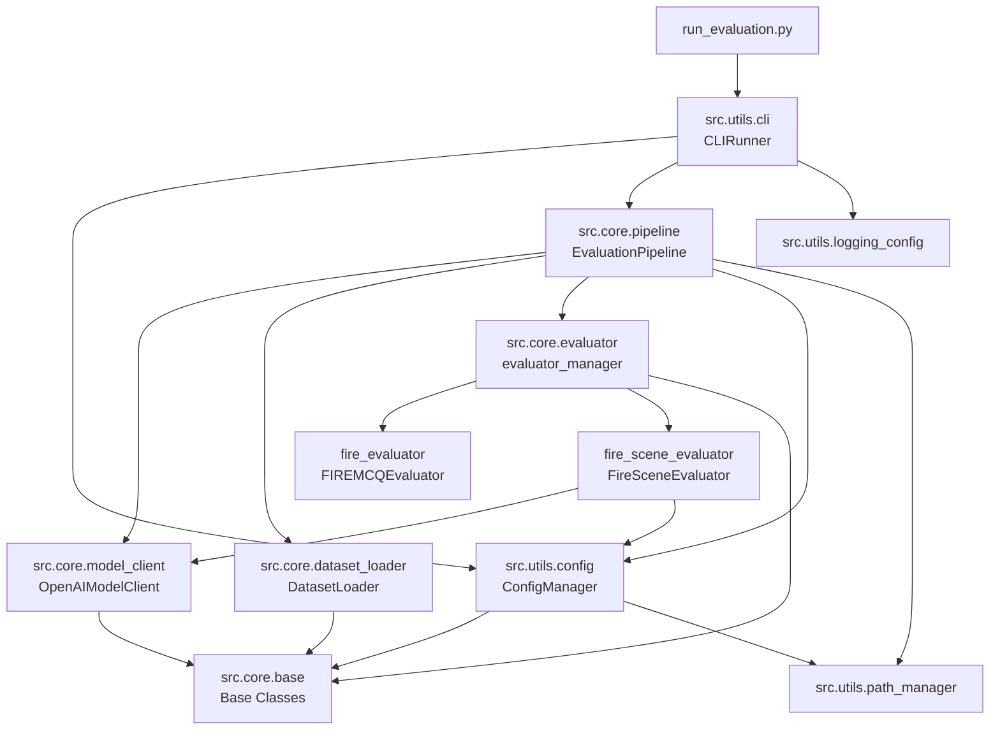

---

## 3. Base Classes and Data Models

### 3.1 Class Diagram

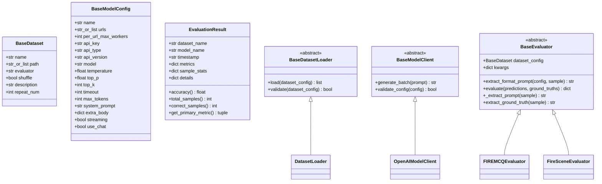

### 3.2 BaseDataset

A Pydantic model that represents a dataset configuration entry from the YAML file.

| Field | Type | Default | Description |
|-------|------|---------|-------------|
| `name` | `str` | required | Unique identifier for the dataset |
| `path` | `str or List[str]` | required | File or directory path(s) to dataset files |
| `evaluator` | `str` | required | Key to look up in evaluator registry (e.g., `fire`, `fire_scene`) |
| `shuffle` | `bool` | `False` | Whether to randomly shuffle samples before evaluation |
| `repeat_num` | `int` | `1` | Number of times to repeat the dataset (for statistical stability) |

### 3.3 BaseModelConfig

Configuration for connecting to an LLM endpoint. All parameters map to OpenAI API conventions.

Key design decisions:
- `urls` is a **list** to support multi-endpoint load balancing
- `extra_body` allows passing vendor-specific parameters (e.g., reasoning mode)
- `use_chat` toggles between chat completion and text completion APIs

### 3.4 EvaluationResult

A flexible result container supporting both simple accuracy metrics and nested multi-level metrics (e.g., per-subtask, per-scene scores). Backward-compatible properties (`accuracy`, `total_samples`, `correct_samples`) allow legacy consumers to read results without changes.

---

## 4. Dataset Loader

### 4.1 Class Structure

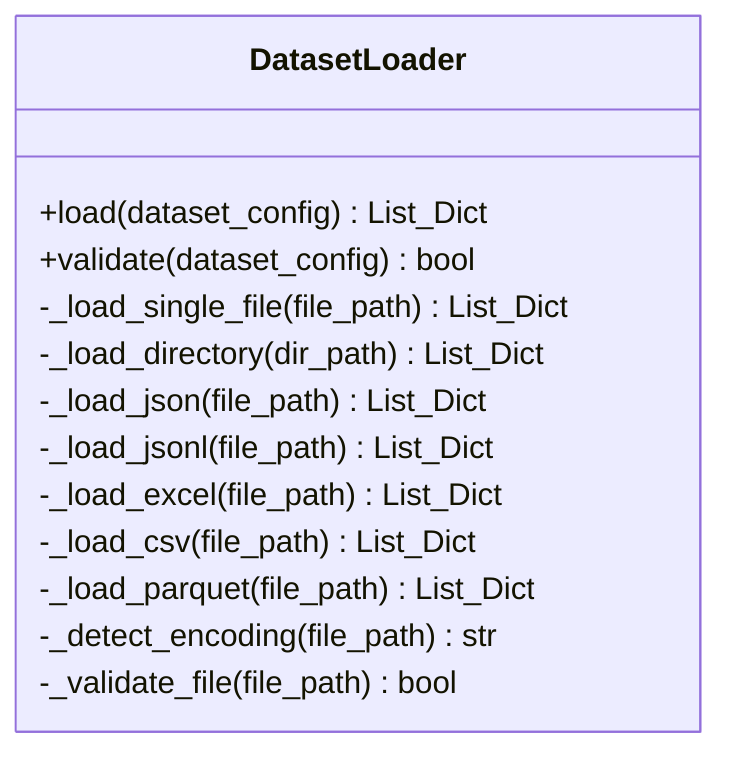

### 4.2 Loading Flow

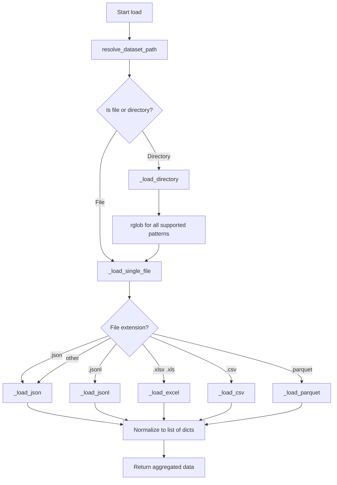

### 4.3 JSON Normalization Logic

The `_load_json` method handles multiple JSON structures:
1. **Array at root**: Returns directly as list of samples
2. **Object with `data` key**: Extracts and returns `data` array
3. **Object with `examples` key**: Extracts and returns `examples` array
4. **Object with `items` key**: Extracts and returns `items` array
5. **Plain object**: Wraps in a single-element list

### 4.4 Encoding Detection

The `_detect_encoding` method tries encodings in order: `utf-8` → `gbk` → `gb2312` → `latin1` → `cp1252`, reading the first 1000 characters to detect which encoding works.

---

## 5. Model Client

### 5.1 Class Structure

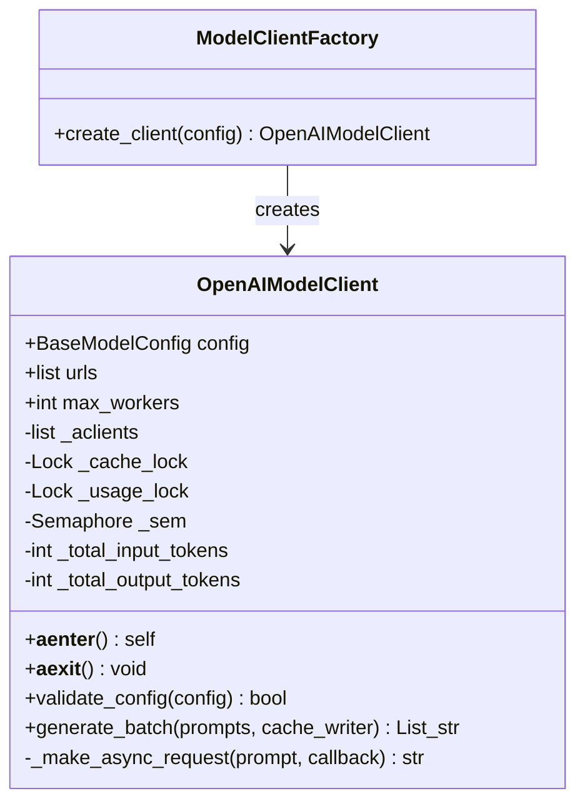

### 5.2 Multi-URL Load Balancing

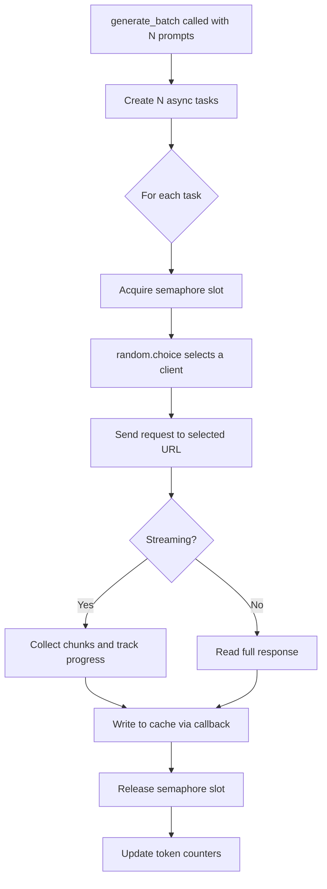

**Concurrency Model**:
- Total workers = `len(urls) x per_url_max_workers`
- An `asyncio.Semaphore` limits concurrent in-flight requests to `max_workers`
- Each request randomly picks one `AsyncOpenAI` client from the pool
- Cache writes are serialized via `asyncio.Lock` to prevent corruption

### 5.3 Streaming Support

When `streaming=True`:
1. The client receives server-sent events (SSE) chunks
2. Each chunk's content delta is accumulated into a list
3. A progress callback is invoked per chunk for real-time UI updates
4. Token usage is extracted from the final chunk's usage field

### 5.4 FIRE-RM Special Handling

When the model name contains `rm` (case-insensitive), a `repetition_penalty` of `1.05` is automatically injected into `extra_body`. This prevents the reward/judge model from generating repetitive output.

---

## 6. Evaluation Pipeline

### 6.1 Class Structure

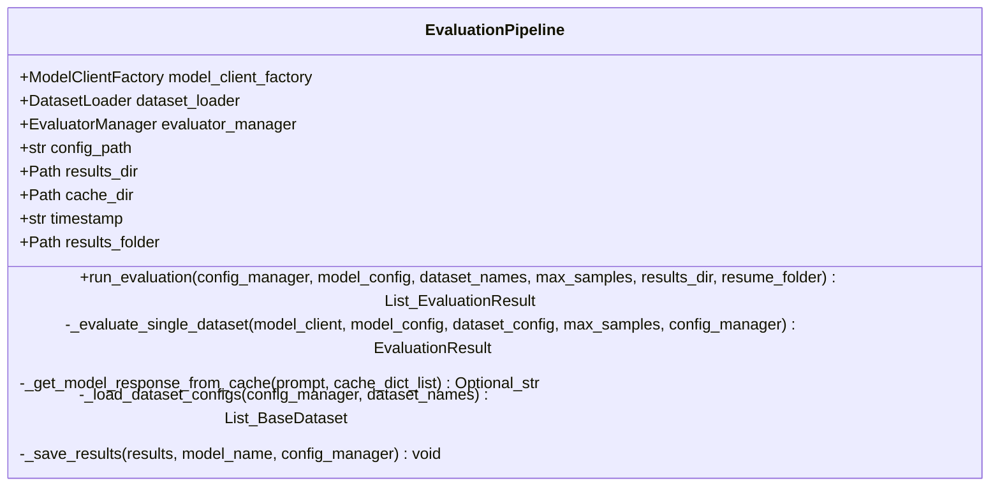

### 6.2 Single Dataset Evaluation Flow

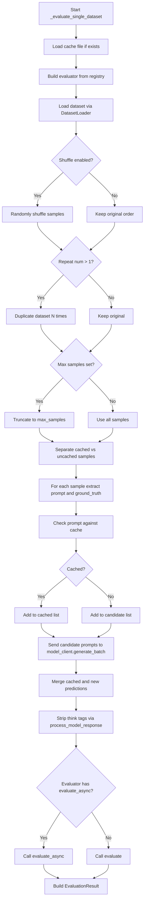

### 6.3 Response Processing — Think Tag Removal

The `process_model_response` function strips chain-of-thought reasoning markers before evaluation:

1. Search for `<think>...</think>` tags
2. Fallback to `<seed:think>...</seed:think>` tags
3. Fallback to `<thinking>...</thinking>` tags
4. If found, extract only the content **after** the closing tag
5. Additionally check for `<answer>...</answer>` tags (used by some models like XuanYuan, DianJing)
6. Return the cleaned response for evaluation

### 6.4 Cache Mechanism

- **Cache file**: `{results_folder}/cache/{model_name}_{dataset_name}.json` (JSONL format)
- **Key**: The full prompt string (exact match)
- **Value**: The model's raw response
- On resume, cached responses are loaded and matched against current prompts
- New responses are appended to the cache file in real-time during batched generation
- Cache is write-through: each response is flushed immediately

### 6.5 Result Persistence

Two types of output files per evaluation run:

1. **Metrics Summary** (`metrics_summary.json`): Contains model name, timestamp, per-dataset metrics (excludes raw sample details)
2. **Per-Dataset Details** (`{model}_{dataset}.json`): Contains every sample with its original data, filled prompt, model response, and correctness flag

---

## 7. Evaluator Subsystem

### 7.1 Registry Pattern

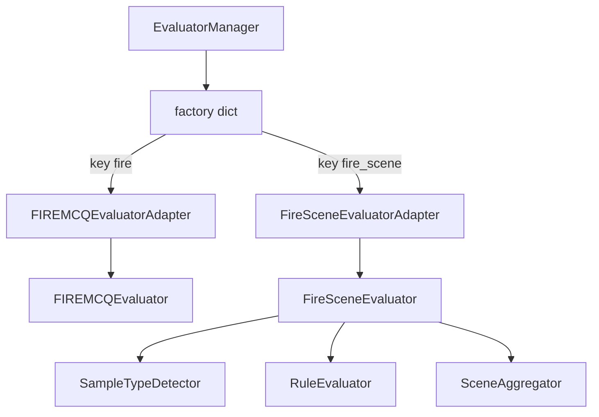

New evaluators can be added by:
1. Creating a class that extends `BaseEvaluator`
2. Decorating it with `@evaluator_manager.register("key_name")`
3. Implementing `extract_format_prompt`, `extract_ground_truth`, and `evaluate` methods

### 7.2 FIRE MCQ Evaluator

**Purpose**: Evaluates multiple-choice questions from financial certification exams.

**Prompt Construction**:
- Concatenates the base prompt with a format instruction: "Answer directly with option letters, output format: Answer: Options"
- Optionally prepends few-shot demonstrations (`demo_count` up to 5)

**Answer Extraction Algorithm** (`extract_choice`):
1. Normalize response: uppercase, remove separators (commas, spaces, Chinese punctuation)
2. Try regex patterns in priority order:
   - `答：ABC` format (Chinese answer marker)
   - `答案是ABC` format (Chinese "the answer is" marker)
   - `答案选项ABC` format
   - Standalone `ABC` at line start
3. Fallback: collect all `[A-E]` characters found anywhere in the response
4. Last resort: random choice from A-E
5. Return deduplicated, sorted option string (e.g., `"ACD"`)

**Scoring**: Exact set match between extracted prediction and gold answer. Per-subtask (benchmark) accuracy is also computed.

### 7.3 FIRE Scene Evaluator

**Purpose**: Evaluates real-world financial scenario tasks using two complementary methods.

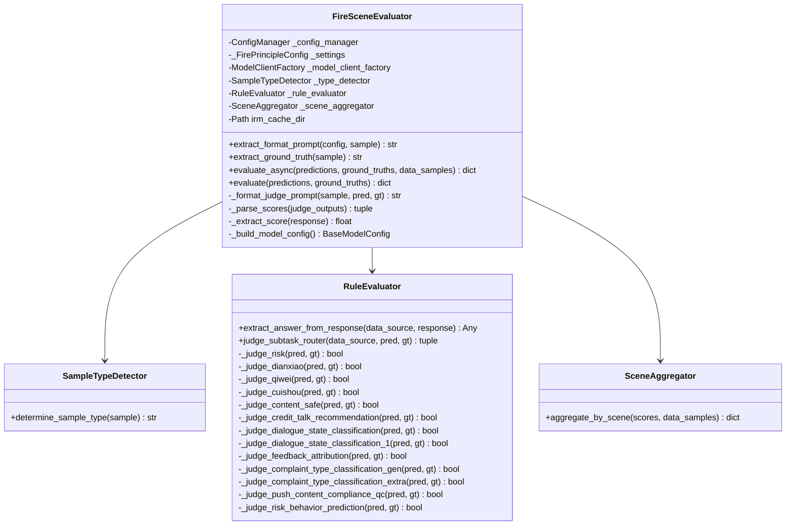

#### 7.3.1 Sample Type Detection

The `SampleTypeDetector` classifies each sample:
- **Principle type**: Sample contains a `准则` (principle) or `principle` field — evaluated by LLM-as-Judge
- **Rule type**: Sample contains a `data_source` field — evaluated by deterministic rule matching
- **Type field**: Falls back to reading a `type` field
- **Unknown**: Treated as invalid (score = None)

#### 7.3.2 Rule-Based Evaluation

The `RuleEvaluator` routes samples to specialized judge functions based on `data_source` keyword matching:

| Data Source Keyword | Judge Function | Business Domain |
|---------------------|---------------|-----------------|
| `risk` | `_judge_risk` | Credit risk approval decisions |
| `dianxiao` | `_judge_dianxiao` | Telesales emotion state classification |
| `cuishou` | `_judge_cuishou` | Collections compliance violation detection |
| `企业微信` | `_judge_qiwei` | Enterprise WeChat routing |
| `金融内容安全拦截` | `_judge_content_safe` | Financial content safety filtering |
| `客户对话状态判断_1` | `_judge_dialogue_state_classification_1` | Dialogue state classification (variant 1) |
| `客户对话状态判断_0` | `_judge_dialogue_state_classification` | Bargaining stage identification |
| `客户反馈归因分析` | `_judge_feedback_attribution` | Customer feedback attribution |
| `客户风险行为预测` | `_judge_risk_behavior_prediction` | Risk behavior prediction |
| `客户投诉类型判断_生成` | `_judge_complaint_type_classification_gen` | Complaint type classification (generative) |
| `客户投诉类型判断_抽取` | `_judge_complaint_type_classification_extra` | Complaint type classification (extractive) |
| `推送内容合规` | `_judge_push_content_compliance_qc` | Push content compliance check |
| `增信话术推荐` | `_judge_credit_talk_recommendation` | Credit enhancement script recommendation |

Each judge function:
1. Parses the prediction (expected JSON format)
2. Parses the ground truth
3. Compares specific fields for exact match
4. Returns `True/False` and a subtask label

#### 7.3.3 Principle-Based Evaluation (LLM-as-Judge)

For open-ended questions, a separate judge model (FIRE-RM) scores responses on a 1-5 scale:

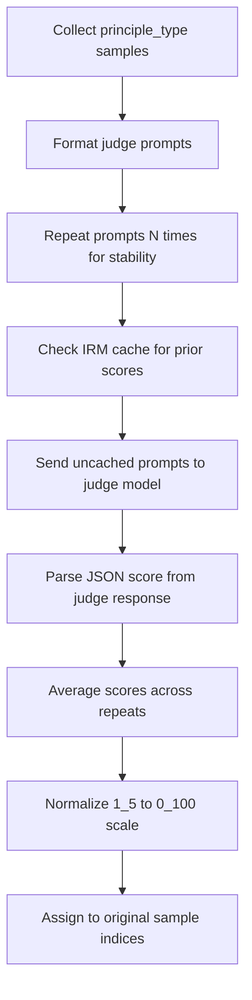

**Score Extraction** (`_extract_score`):
1. Try to extract a JSON block `{...}` from the response
2. Parse the `score` field from the JSON
3. Fallback: regex for `"score": <number>`
4. Last resort: find any standalone number 1-5 in the response

**Score Normalization**: Raw score in [1, 5] is mapped to [0, 100] via: $\text{normalized} = \frac{(\text{score} - 1)}{4} \times 100$

#### 7.3.4 Scene Aggregation

The `SceneAggregator` groups scores by hierarchical scene labels:
- **Primary scene** (`top_name`): e.g., "Banking", "Insurance"
- **Secondary scene** (`task_name`): e.g., "Corporate Finance Risk Control"
- Separate averages for principle-type vs rule-type samples
- Error counters for samples that failed evaluation

---

## 8. Utility Modules

### 8.1 Path Manager

Uses `pyrootutils` to locate the project root by searching for marker files (`.gitignore`, `pyproject.toml`, `setup.py`, `requirements.txt`). Implements the **Singleton pattern** to ensure consistent path resolution throughout the application.

Key paths managed:
- `get_project_root()` — Absolute project root
- `get_config_path()` — Config YAML location
- `get_results_path()` — Results output directory (auto-created)
- `get_cache_path()` — Per-run cache directory (auto-created)
- `get_irm_cacahe_path()` — Judge model cache directory (auto-created)
- `resolve_dataset_path()` — Resolves relative paths to absolute; supports both single and list paths

### 8.2 Configuration Manager

Responsibilities:
1. Load and parse `datasets.yaml`
2. Create `BaseDataset` objects with resolved paths
3. Create `BaseModelConfig` objects by merging CLI args with YAML defaults
4. Provide dataset listing and validation utilities

### 8.3 Logging Configuration

Uses `loguru` with the following setup:
- Default level: `INFO` (switchable to `DEBUG` with `--verbose`)
- HTTP client logging suppressed (httpx, urllib3, openai, azure)
- Colored console output with structured formatting

---

## 9. Error Handling Strategy

| Scenario | Handling |
|----------|----------|
| API request failure | Returns empty string; logs error; evaluation continues |
| Invalid sample (missing fields) | Logs warning; skips sample; evaluation continues |
| JSON parse error in response | Returns `False` (incorrect); logs warning |
| Cache file missing | Creates new cache; starts fresh |
| Dataset file not found | Raises `FileNotFoundError` |
| Score extraction failure | Returns `None`; counted in error statistics |
| All predictions empty | Returns zero-score result with all-invalid stats |

---

## 10. Configuration Schema

### datasets.yaml Structure

```yaml
datasets:
  DATASET_NAME:
    name: string                    # Dataset identifier
    description: string             # Human readable description
    path: string_or_list            # File or directory path
    evaluator: string               # Registry key: fire or fire_scene
    shuffle: boolean                # Random sample ordering
    repeat_num: integer             # Dataset repetition count
    # Scene-specific fields
    prompt_path: string             # Path to prompt template Python file
    prompt_name: string             # Variable name in prompt file
    judge_model: string             # Judge model name
    judge_model_urls: list          # Judge API endpoints
    judge_model_api_key: string     # Judge API key
    judge_model_api_type: string    # Judge API type
    judge_max_tokens: integer       # Judge response length limit
    judge_repeat_num: integer       # Number of judge repeats
    judge_temperature: float        # Judge sampling temperature
    judge_top_p: float              # Judge nucleus sampling
    judge_timeout: integer          # Judge request timeout
    judge_per_url_max_workers: int  # Judge concurrency per URL
    judge_system_prompt: string     # Judge system prompt

defaults:
  temperature: float               # Default sampling temperature
  top_p: float                     # Default nucleus sampling
  max_tokens: integer              # Default max response tokens
  timeout: integer                 # Default request timeout
  system_prompt: string            # Default system prompt
  extra_body: dict                 # Default extra request parameters
```
