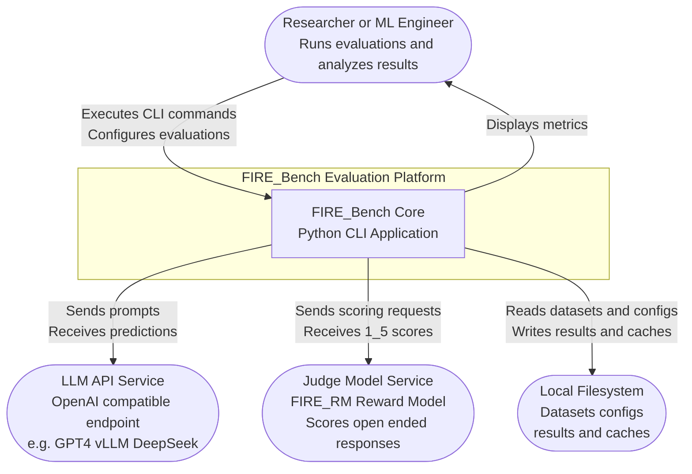
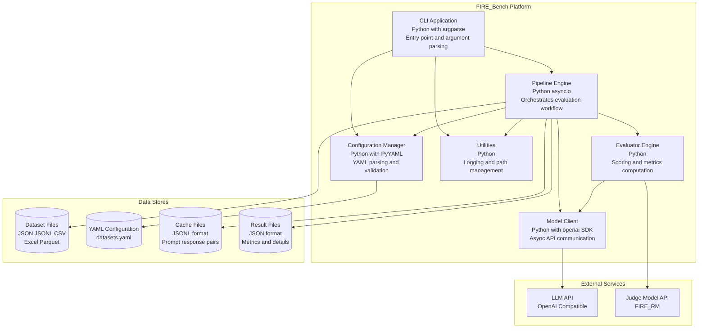
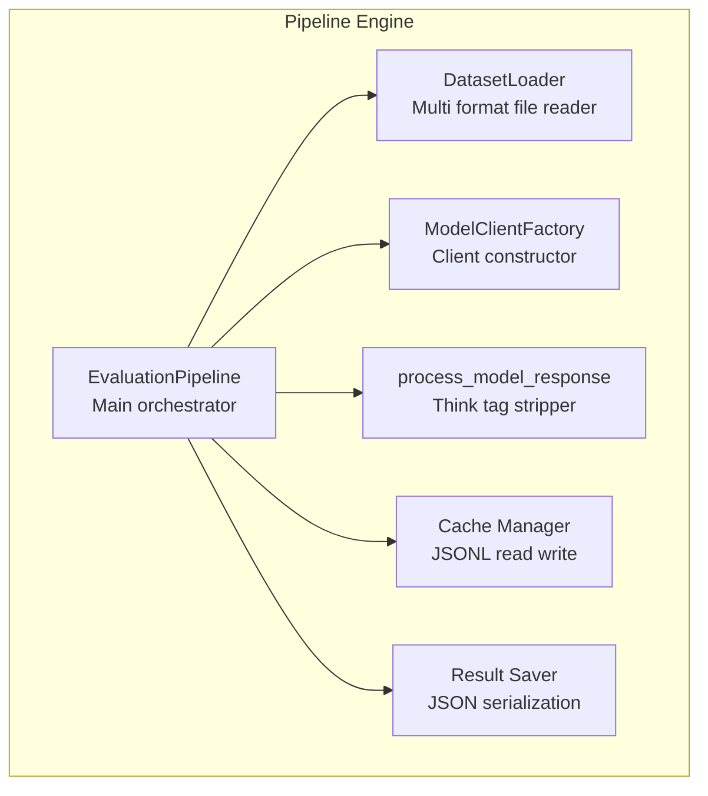
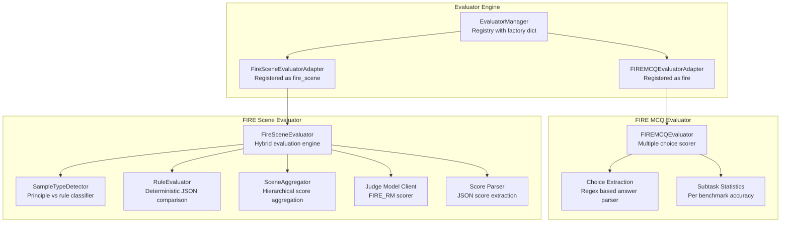
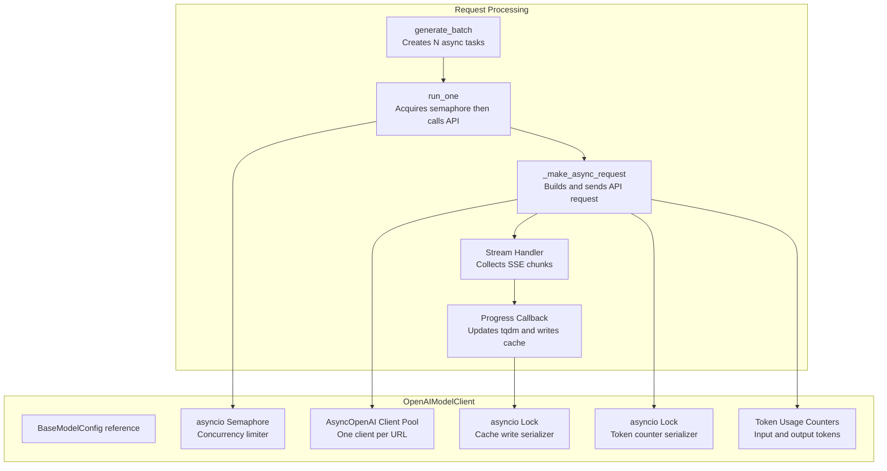
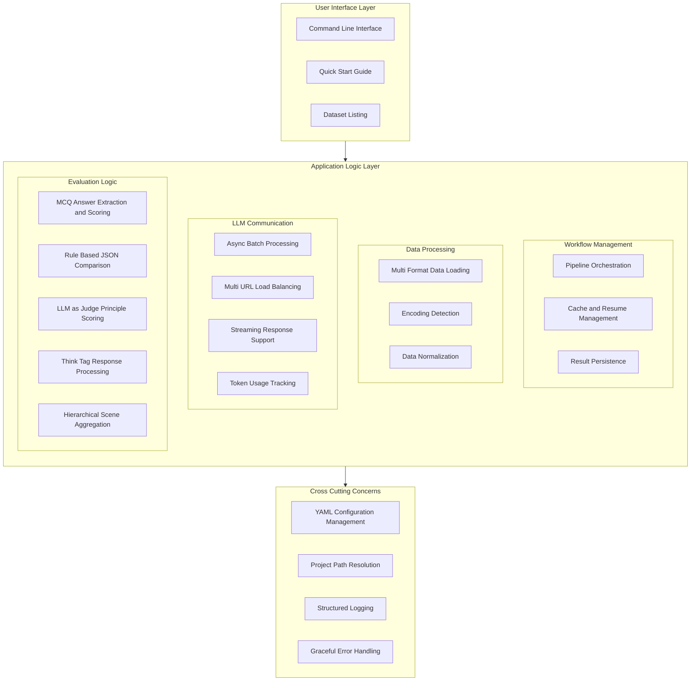
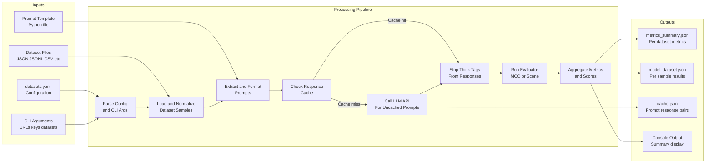
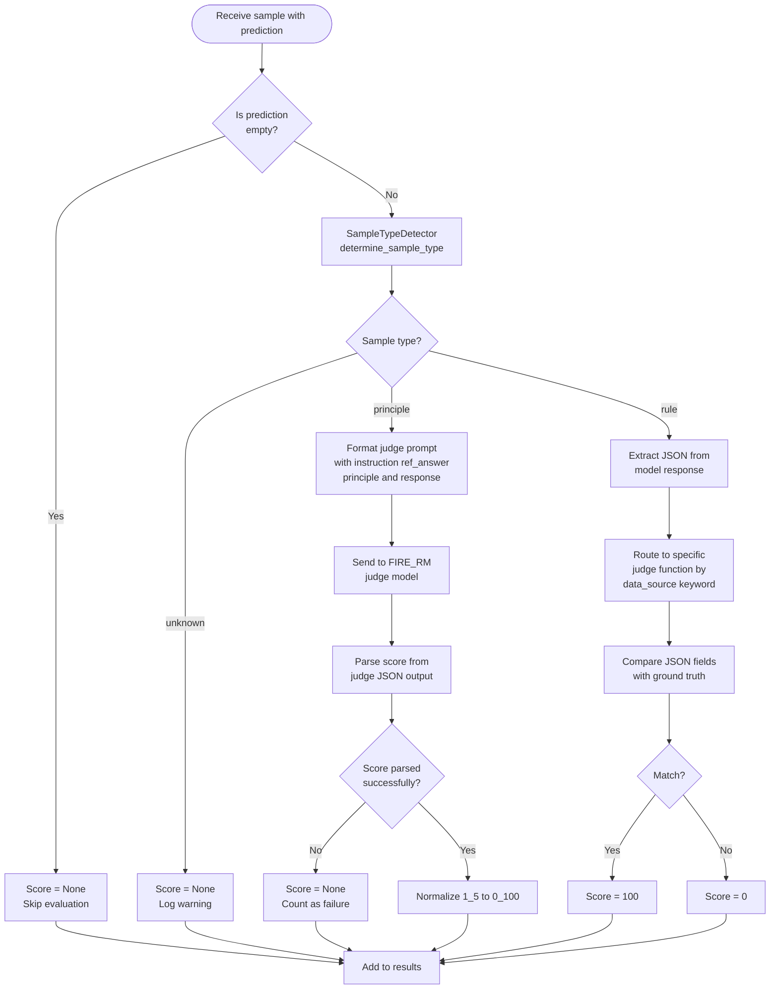

# C4 Diagrams and Logical Architecture — FIRE-Bench

This document contains C4 model diagrams (Context, Container, Component, Code) and logical architecture diagrams for the FIRE-Bench platform, all rendered in Mermaid format.

---

## 1. C4 Level 1 — System Context Diagram

Shows FIRE-Bench in the context of its external actors and systems.

---

## 2. C4 Level 2 — Container Diagram

Shows the major containers (executable units and data stores) within the system.

---

## 3. C4 Level 3 — Component Diagram

Shows the internal components of the Pipeline Engine and Evaluator Engine.

### 3.1 Pipeline Engine Components

### 3.2 Evaluator Engine Components

---

## 4. C4 Level 4 — Code Level Diagram

### 4.1 Model Client Internal Architecture

---

## 5. Logical Architecture Diagram

Shows the logical grouping of all system capabilities.

---

## 6. Data Flow Diagram

Shows how data flows through the system during a complete evaluation run.

---

## 7. Evaluation Decision Flow

Shows the branching logic during the evaluation of a single sample.

---

## 8. File Structure Diagram

```mermaid
graph TD
    Root[FIRE_Bench Project Root]
    Root --> run_eval[run_evaluation.py<br>Entry point]
    Root --> requirements[requirements.txt<br>Dependencies]
    Root --> config_dir[config directory]
    Root --> dataset_dir[dataset directory]
    Root --> src_dir[src directory]
    Root --> results_dir[results directory<br>Generated at runtime]

    config_dir --> datasets_yaml[datasets.yaml<br>Dataset and default configs]

    dataset_dir --> fire_dir[FIRE directory]
    dataset_dir --> fire_scene_dir[FIRE_SCENE directory]
    fire_dir --> fire_json[FIRE.json<br>14000 plus MCQ questions]
    fire_scene_dir --> prompt_py[prompt.py<br>Judge prompt template]
    fire_scene_dir --> principle_dir[principle directory]
    principle_dir --> scene_jsonl[scene_principle.release.jsonl<br>Scene evaluation data]

    src_dir --> core_dir[core directory]
    src_dir --> utils_dir[utils directory]

    core_dir --> base_py[base.py<br>Abstract classes and data models]
    core_dir --> pipeline_py[pipeline.py<br>Evaluation orchestrator]
    core_dir --> model_client_py[model_client.py<br>Async OpenAI client]
    core_dir --> dataset_loader_py[dataset_loader.py<br>Multi format data reader]
    core_dir --> evaluator_dir[evaluator directory]

    evaluator_dir --> evaluator_py[evaluator.py<br>Registry and adapters]
    evaluator_dir --> fire_evaluator_py[fire_evaluator.py<br>MCQ scoring logic]
    evaluator_dir --> fire_scene_py[fire_scene_evaluator.py<br>Scene evaluation logic]

    utils_dir --> cli_py[cli.py<br>CLI runner]
    utils_dir --> config_py[config.py<br>Config manager]
    utils_dir --> path_manager_py[path_manager.py<br>Path resolution]
    utils_dir --> logging_py[logging_config.py<br>Logging setup]

    results_dir --> run_folder[model_dataset_timestamp<br>Per run output folder]
    run_folder --> metrics_json[metrics_summary.json]
    run_folder --> detail_json[model_dataset.json]
    run_folder --> cache_dir[cache directory]
    run_folder --> irm_cache_dir[irm_cache directory]
    cache_dir --> cache_jsonl[model_dataset.json<br>JSONL cache]
    irm_cache_dir --> irm_jsonl[judge_model.json<br>JSONL judge cache]
```

