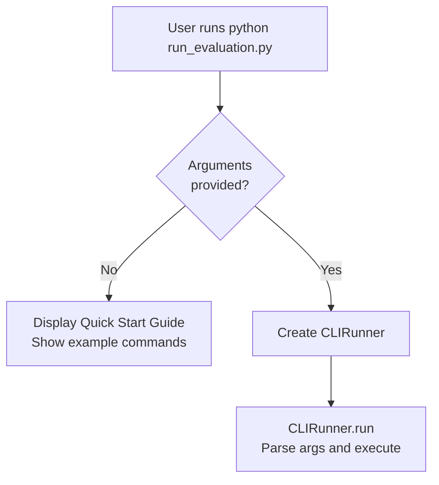
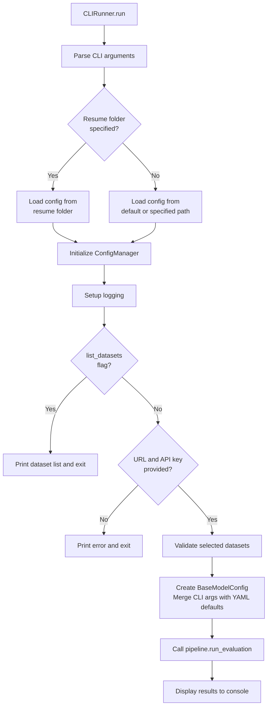
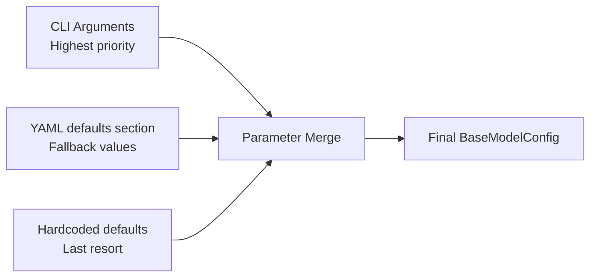
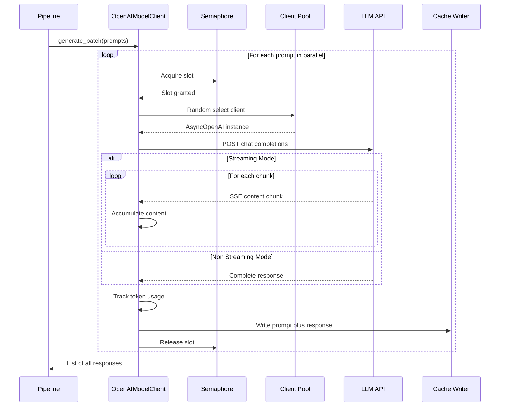
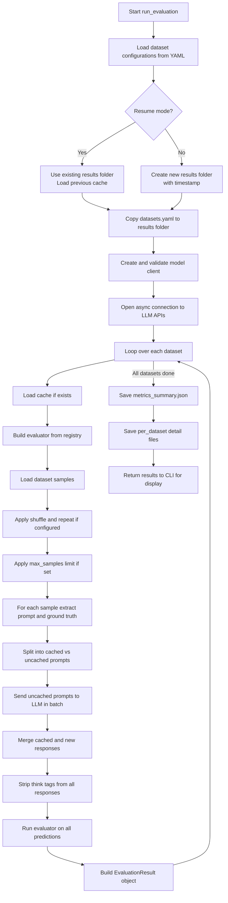
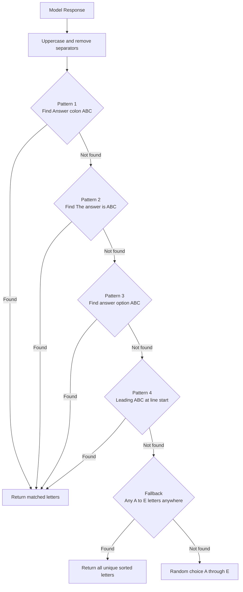
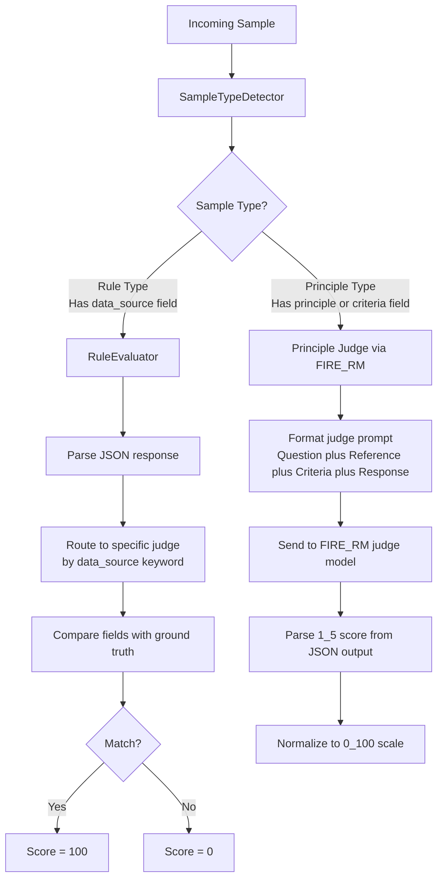
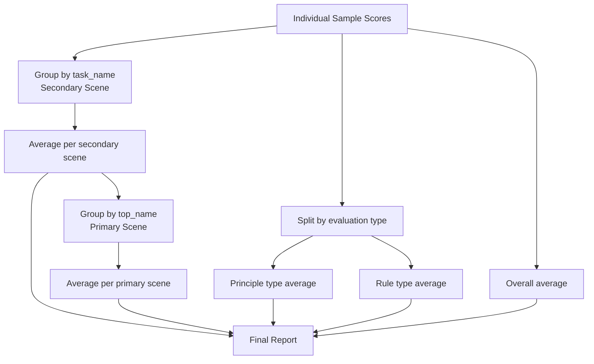
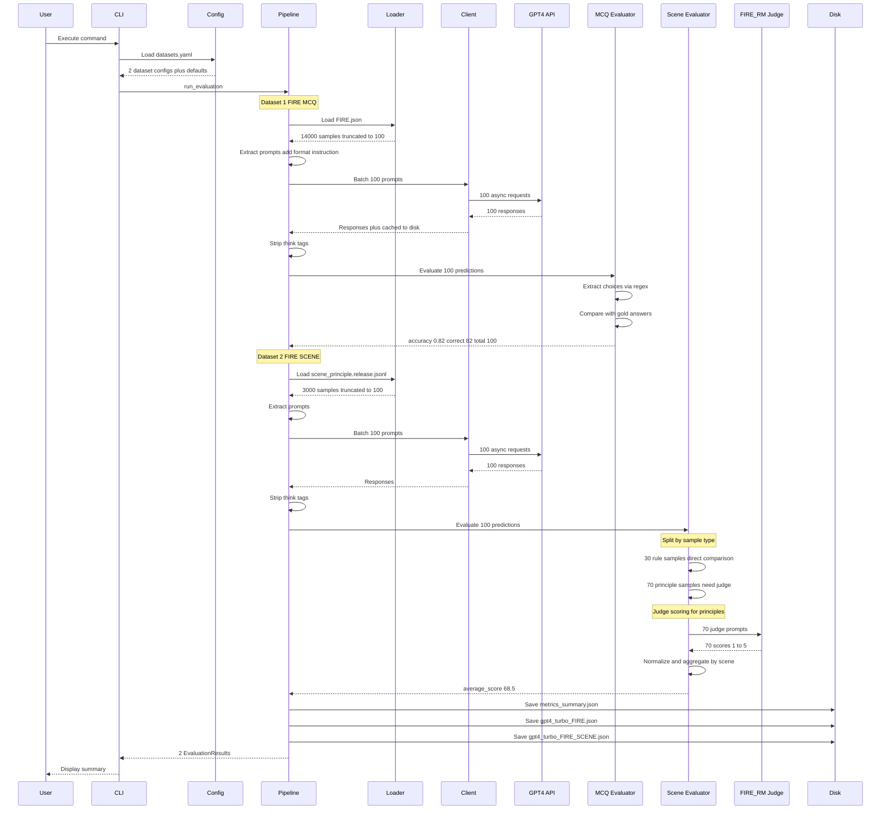

# Functional and Technical Documentation — FIRE-Bench

This document provides a detailed functional and technical walkthrough of each code module in the FIRE-Bench platform. It is written to be understandable by both technical contributors and non-technical stakeholders, focusing on **what** each part does, **why** it exists, and **how** it interacts with other parts.

---

## Table of Contents

1. [System Entry Point](#1-system-entry-point)
2. [Command Line Interface (CLI)](#2-command-line-interface)
3. [Configuration Management](#3-configuration-management)
4. [Dataset Loading](#4-dataset-loading)
5. [LLM Communication (Model Client)](#5-llm-communication)
6. [Evaluation Pipeline (Orchestrator)](#6-evaluation-pipeline)
7. [FIRE MCQ Evaluator](#7-fire-mcq-evaluator)
8. [FIRE Scene Evaluator](#8-fire-scene-evaluator)
9. [Path Management](#9-path-management)
10. [Logging](#10-logging)
11. [End-to-End Workflow Example](#11-end-to-end-workflow-example)

---

## 1. System Entry Point

**File**: `run_evaluation.py`

### What It Does
This is the front door of the application. When a user types `python run_evaluation.py ...`, this file is what Python executes first.

### Business Logic Steps
1. **No arguments provided**: Displays a "Quick Start Guide" showing example commands and usage tips — helping new users get oriented without reading documentation
2. **Arguments provided**: Creates a `CLIRunner` instance and calls its `run()` method, which takes over the entire evaluation workflow

### Key Behaviors
- Disables Python bytecode caching (`__pycache__`) to keep the working directory clean
- Adds the project root to the Python path so all `src.*` imports work regardless of where the script is invoked from



---

## 2. Command Line Interface

**File**: `src/utils/cli.py`

### What It Does
Parses user-provided command-line arguments, validates them, and routes to the appropriate action (list datasets, run evaluation).

### Functional Walkthrough

The CLI accepts the following categories of parameters:

**Model Connection Parameters**:
| Parameter | Purpose | Example |
|-----------|---------|---------|
| `--url` | One or more LLM API endpoint URLs | `https://api.openai.com/v1` |
| `--api-key` | Authentication key for the API | `sk-abc123` |
| `--model` | Model identifier sent to the API | `gpt-4` |
| `--model-name` | Human-readable name used in result file names | `gpt4-eval` |
| `--api-type` | API flavor (default or azure) | `azure` |
| `--per-url-max-workers` | Concurrent request limit per URL | `128` |

**Dataset Parameters**:
| Parameter | Purpose | Example |
|-----------|---------|---------|
| `--datasets` | Which datasets to evaluate on | `FIRE FIRE_SCENE` |
| `--max-samples` | Limit evaluation to N samples (for testing) | `10` |
| `--config-file` | Path to the YAML configuration file | `config/datasets.yaml` |

**Execution Parameters**:
| Parameter | Purpose | Example |
|-----------|---------|---------|
| `--streaming` | Enable streaming API responses | `true` |
| `--use-chat` | Use chat vs. text completion API | `true` |
| `--results-dir` | Output directory for results | `results` |
| `--resume-folder` | Resume from a previous run's folder | `results/gpt4_FIRE_03021430` |
| `--verbose` | Enable debug-level logging | flag |
| `--list-datasets` | Show available datasets and exit | flag |

### Business Logic Flow



### Resume Feature
When `--resume-folder` is specified, the system:
1. Loads the configuration from the previous run's saved `datasets.yaml`
2. Reuses the previous run's output folder
3. Loads cached responses to avoid re-calling the LLM for already-completed prompts
4. Only processes uncached prompts, then saves merged results

---

## 3. Configuration Management

**File**: `src/utils/config.py`

### What It Does
Reads the YAML configuration file and creates strongly-typed Python objects that the rest of the system uses. Acts as the single source of truth for dataset definitions and default model parameters.

### Key Responsibilities

1. **Load YAML**: Reads `config/datasets.yaml` and parses it into a Python dictionary
2. **Create Dataset Configs**: Converts each dataset entry into a `BaseDataset` object with resolved file paths
3. **Create Model Configs**: Merges CLI-provided parameters with YAML defaults to create a complete `BaseModelConfig`
4. **Validate Datasets**: Checks that requested dataset names exist in the configuration
5. **List Datasets**: Provides discovery information (name, description, path, existence) for all configured datasets

### How Defaults Work

The YAML file has a `defaults` section that specifies fallback values for model parameters:



Priority order (highest to lowest):
1. Explicitly provided CLI arguments
2. Values from the `defaults` section of `datasets.yaml`
3. Hardcoded defaults in the code (e.g., `temperature=0.0`, `max_tokens=1024`)

---

## 4. Dataset Loading

**File**: `src/core/dataset_loader.py`

### What It Does
Reads financial evaluation data from various file formats and normalizes it into a uniform list-of-dictionaries structure that the pipeline can process uniformly.

### Supported Formats

| Format | Extension | Method | Notes |
|--------|-----------|--------|-------|
| JSON | `.json` | `json.load` | Handles array, object with `data`/`examples`/`items` keys |
| JSON Lines | `.jsonl` | Line-by-line `json.loads` | Skips malformed lines with warning |
| CSV | `.csv` | `pandas.read_csv` | Auto-detect encoding |
| Excel | `.xlsx`, `.xls` | `pandas.read_excel` | Requires openpyxl |
| Parquet | `.parquet` | `pandas.read_parquet` | Requires pyarrow |

### Directory Loading
When a dataset path points to a **directory**, the loader:
1. Recursively scans all subdirectories using `rglob`
2. Matches files against all supported extension patterns
3. Loads each file individually
4. Combines all records into a single flat list
5. Logs the number of samples loaded from each file

This is particularly useful for the FIRE_SCENE dataset, which stores principle data in a directory structure.

### Validation
Before loading, the `validate` method can verify:
- JSON files are parseable
- JSONL files have valid first lines
- CSV/Excel/Parquet files are non-empty

---

## 5. LLM Communication

**File**: `src/core/model_client.py`

### What It Does
Handles all communication with LLM API endpoints. Sends prompts and receives model-generated responses, managing concurrency, load balancing, caching, and progress tracking.

### Key Features Explained for Non-Technical Readers

**Multi-Endpoint Load Balancing**: Imagine you have 3 servers, each running a copy of the AI model. Instead of sending all questions to one server (which would be slow), the system randomly distributes questions across all 3 servers — like having 3 checkout lanes at a store.

**Concurrency Control**: The system doesn't send all 14,000 questions at once (which would overwhelm the server). Instead, it maintains a configurable limit (default: 128 per server) on how many questions are "in flight" simultaneously.

**Streaming Mode**: Like watching a video stream vs. downloading the whole file first. In streaming mode, the system receives the response word-by-word as it's generated, which provides real-time progress feedback.

**Automatic Caching**: After receiving each response, it's immediately saved to a file. If the evaluation is interrupted and restarted, the system skips questions that were already answered.

### Request Lifecycle



### Token Usage Tracking
The client tracks cumulative input and output token counts across all requests in a batch. These are logged at the end of batch processing, helping users estimate API costs.

---

## 6. Evaluation Pipeline

**File**: `src/core/pipeline.py`

### What It Does
This is the **conductor of the orchestra** — it coordinates all other components to execute a complete evaluation run. It loads data, calls the model, evaluates responses, and saves results.

### Business Process Flow



### Response Processing (Think Tag Stripping)

Many modern LLMs output their reasoning process inside special tags before giving the final answer. The pipeline strips these tags so the evaluator only sees the actual answer:

| Tag Format | Example | Model Types |
|------------|---------|-------------|
| `<think>...</think>` | DeepSeek-R1, Qwen-QwQ | Standard reasoning tags |
| `<seed:think>...</seed:think>` | Custom fine-tuned models | Seed-prefixed variant |
| `<thinking>...</thinking>` | Claude-style models | Alternative format |
| `<answer>...</answer>` | XuanYuan-Fin-X1, DianJing-R1 | Answer-wrapped format |

### Result File Structure

Each evaluation run produces a folder like:
```
results/
  gpt4_FIRE_03021430/
    datasets.yaml          # Snapshot of configuration used
    metrics_summary.json   # Aggregate metrics for all datasets
    gpt4_FIRE.json         # Detailed per-sample results for FIRE
    gpt4_FIRE_SCENE.json   # Detailed per-sample results for FIRE_SCENE
    cache/
      gpt4_FIRE.json       # Cached prompt-response pairs (JSONL)
    irm_cache/
      fire_principle_judge_irm_32b.json  # Cached judge scores (JSONL)
```

---

## 7. FIRE MCQ Evaluator

**File**: `src/core/evaluator/fire_evaluator.py`

### What It Does
Evaluates the model's performance on **multiple-choice questions** from financial certification exams. This covers 14 types of professional certifications including CFA, FRM, CPA, and more.

### Business Logic

**Step 1: Prompt Construction**
- Takes the question template and the actual question text
- Appends a format instruction in Chinese: "Please directly give the correct option(s). Output format: Answer: Options, e.g., Answer: ABC"
- Optionally includes few-shot demonstration examples (up to 5) to help the model understand the expected format

**Step 2: Ground Truth Extraction**
- Reads the `gold` field from the sample
- Normalizes to uppercase (e.g., `"abc"` → `"ABC"`)

**Step 3: Answer Extraction from Model Response**
The model's free-text response must be converted to option letters. The extraction algorithm uses a priority cascade:



**Step 4: Scoring**
- A prediction is **correct** only if the extracted option set **exactly matches** the gold answer set
- Example: Gold = `"AC"`, Prediction = `"CA"` → Correct (set comparison)
- Example: Gold = `"AC"`, Prediction = `"A"` → Incorrect (missing C)

**Step 5: Subtask Breakdown**
Results are broken down by the `benchmark` field in each sample (e.g., CFA, CPA, FRM), allowing users to see which certification areas the model excels or struggles in.

### Output Metrics
| Metric | Description |
|--------|-------------|
| `accuracy` | Overall fraction of correctly answered questions |
| `correct` | Count of correct predictions |
| `total` | Total number of questions |
| `error_rate` | `1 - accuracy` |
| `subtask_accuracy` | Per-certification-exam accuracy breakdown |

---

## 8. FIRE Scene Evaluator

**File**: `src/core/evaluator/fire_scene_evaluator.py`

### What It Does
Evaluates the model's performance on **real-world financial scenario tasks**. This is the more complex evaluator, handling two fundamentally different types of evaluation within a single framework.

### Two Evaluation Modes



### Rule-Based Evaluation (Deterministic)

For tasks with clear right/wrong answers, the system parses the model's JSON output and checks specific fields. Here's what each rule judge checks:

| Financial Task | What It Checks | Example |
|---------------|---------------|---------|
| **Risk Control** | Whether approval/rejection matches the ground truth | Model says "approve loan" → ground truth is "0" (approve) → Correct |
| **Telesales Analysis** | Customer emotion state classification | "Customer cursing" vs. "Customer refusing calls" vs. "Other" |
| **Collections Compliance** | Agent violation detection + violation type matching | Checks both whether violation occurred and what type |
| **Enterprise WeChat** | Router classification | Whether the model routes the conversation correctly |
| **Content Safety** | Document type + company registration status | Two-field exact match |
| **Dialogue State** | Current negotiation stage identification | Exact category match |
| **Feedback Attribution** | Business line + call type + complaint inclusion | Three-field exact match |
| **Complaint Classification** | Primary and secondary category matching | Hierarchical category comparison |
| **Content Compliance** | Per-item compliance status | Checks each push content item's compliance flag |
| **Risk Behavior Prediction** | Standard category + ID matching | Two-field exact match |

### Principle-Based Evaluation (LLM-as-Judge)

For open-ended tasks where there is no single correct answer, a specialized reward model (FIRE-RM) acts as a judge:

**Judge Prompt Construction**:
The judge receives a structured prompt containing:
1. **The Question**: What was asked of the model
2. **Reference Answer**: An optional expert-written reference (may be empty)
3. **Evaluation Criteria (Principle)**: Detailed 1-5 scoring rubric specific to this question
4. **Model Response**: The model's actual output

The judge model then scores the response from 1 to 5 based on the rubric criteria.

**Key Scoring Rules** (embedded in the judge prompt):
- Response length should NOT influence scoring unless explicitly required by the question
- Scoring must strictly follow the provided rubric criteria
- Examples in rubric criteria (after words like "such as") are illustrative, not exhaustive
- Factual errors should result in lower scores regardless of how polished the response appears
- If no reference answer is provided, the judge must evaluate based solely on the rubric

**Score Reliability**: To improve scoring consistency, the same judge prompt can be sent `repeat_num` times. The final score is the average of all valid scores across repeats.

### Scene-Level Aggregation

Results are aggregated at multiple levels for comprehensive reporting:



### Output Metrics
| Metric | Description |
|--------|-------------|
| `average_score` | Mean score across all valid samples (0-100 scale) |
| `total` | Total number of samples |
| `valid_scores` | Number of samples successfully scored |
| `invalid_scores` | Number of samples that could not be scored |
| `scene_averages.primary_scenes` | Average score per primary business area |
| `scene_averages.secondary_scenes` | Average score per specific task type |
| `scene_averages.principle_scene_average` | Average for open-ended (principle) tasks |
| `scene_averages.rule_scene_average` | Average for deterministic (rule) tasks |
| `score_distribution` | Distribution of scores (how many samples got each score level) |

---

## 9. Path Management

**File**: `src/utils/path_manager.py`

### What It Does
Provides a centralized, reliable way to find files and directories within the project. Solves the common problem of "where is my project root?" when scripts are run from different locations.

### How It Works
1. Uses `pyrootutils` library to search **upward** from the current file's location
2. Looks for project root indicators: `.gitignore`, `pyproject.toml`, `setup.py`, `requirements.txt`
3. If found, that directory becomes the project root
4. If not found, falls back to computing the root from the file's own location
5. All subsequent path requests are resolved relative to this root

### Singleton Pattern
The `ProjectPathManager` uses the Singleton design pattern — only one instance exists in the entire application. This ensures that all modules agree on where the project root is, preventing path resolution inconsistencies.

### Convenience Functions
The module exports simple functions that wrap the singleton:
- `get_project_root()` — Returns the absolute project root path
- `get_config_path(file)` — Returns absolute path to a config file
- `get_results_path(dir)` — Returns results directory (creates if missing)
- `get_cache_path(dir)` — Returns cache directory (creates if missing)
- `resolve_dataset_path(path)` — Converts relative dataset paths to absolute; handles both single paths and lists

---

## 10. Logging

**File**: `src/utils/logging_config.py`

### What It Does
Configures the application's logging system to provide useful diagnostic output while suppressing noise from HTTP libraries.

### Key Behaviors
- Uses `loguru` library for structured, colored console logging
- **Suppressed loggers**: httpx, urllib3, requests, openai, azure — these generate verbose HTTP request logs that clutch the output
- **Default level**: INFO — shows important events (dataset loaded, batch started, results saved)
- **Verbose mode**: DEBUG — shows detailed information (individual sample processing, response content)
- Format includes timestamp, log level, source location, and message

---

## 11. End-to-End Workflow Example

### Scenario: Evaluating GPT-4 on both FIRE datasets

**Command**:
```bash
python run_evaluation.py \
  --url https://api.openai.com/v1 \
  --api-key sk-abc123 \
  --model gpt-4 \
  --model-name gpt4-turbo \
  --datasets FIRE FIRE_SCENE \
  --max-samples 100 \
  --results-dir results
```

**What Happens Step by Step**:



**Output Files Created**:
```
results/gpt4-turbo_FIRE-FIRE_SCENE_03021430/
├── datasets.yaml                    # Configuration snapshot
├── metrics_summary.json             # Overall metrics
├── gpt4-turbo_FIRE.json            # Per-question MCQ results
├── gpt4-turbo_FIRE_SCENE.json      # Per-question scene results
├── cache/
│   ├── gpt4-turbo_FIRE.json        # Cached MCQ responses
│   └── gpt4-turbo_FIRE_SCENE.json  # Cached scene responses
└── irm_cache/
    └── fire_principle_judge_irm-32b.json  # Cached judge scores
```

---

## 12. Glossary

| Term | Definition |
|------|-----------|
| **FIRE** | Financial Intelligence and Reasoning Evaluation — the benchmark name |
| **MCQ** | Multiple Choice Question — questions with predefined answer options |
| **FIRE-RM** | FIRE Reward Model — a specialized LLM that scores open-ended responses on a 1-5 scale |
| **LLM-as-Judge** | The practice of using one LLM to evaluate the output quality of another LLM |
| **Principle** | A structured scoring rubric (1-5 scale) that tells the judge model how to evaluate a response |
| **Think Tags** | XML-like markers (e.g., `<think>...</think>`) that some LLMs use to show their internal reasoning |
| **JSONL** | JSON Lines — a file format where each line is a separate JSON object |
| **Semaphore** | A concurrency control mechanism that limits how many operations happen simultaneously |
| **Cache Hit** | When a prompt has already been sent to the LLM before and the saved response can be reused |
| **Resume** | The ability to continue an interrupted evaluation from where it left off using cached data |
| **Subtask** | A sub-category within a dataset, such as a specific certification exam (CFA, CPA) or business scenario |
| **Scene Aggregation** | Grouping evaluation scores by business area (primary scene) and specific task type (secondary scene) |
