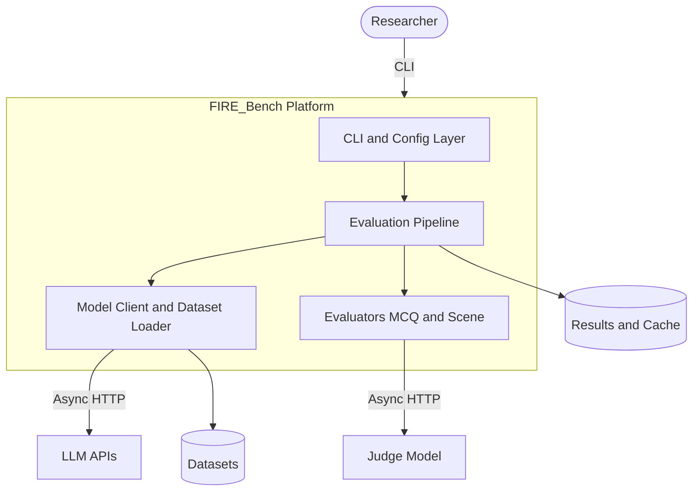

# FIRE-Bench Reference Documentation

Comprehensive documentation for the **FIRE-Bench** (Financial Intelligence and Reasoning Evaluation) platform — an automated benchmarking system for evaluating LLM capabilities in the financial domain.

---

## Document Index

| # | Document | Description | Audience |
|---|----------|-------------|----------|
| 1 | [High-Level Design (HLD)](01-HIGH-LEVEL-DESIGN.md) | System context, architecture overview, component summary, technology stack, quality attributes, and deployment topology | Architects, managers, stakeholders |
| 2 | [Low-Level Design (LLD)](02-LOW-LEVEL-DESIGN.md) | Detailed class structures, method signatures, algorithms (answer extraction, score parsing), data flows, configuration schema, and error handling | Developers, contributors |
| 3 | [Architecture Decision Records (ADR)](03-ARCHITECTURE-DECISION-RECORDS.md) | 10 key architectural decisions with context, rationale, and consequences (API choice, concurrency model, evaluator registry, caching strategy, etc.) | Architects, tech leads |
| 4 | [C4 Diagrams and Logical Architecture](04-C4-DIAGRAMS-AND-LOGICAL-ARCHITECTURE.md) | C4 model diagrams (Context, Container, Component, Code), logical architecture, data flow diagrams, evaluation decision flow, and file structure diagram — all in Mermaid format | All audiences |
| 5 | [Functional and Technical Documentation](05-FUNCTIONAL-AND-TECHNICAL-DOCUMENTATION.md) | Step-by-step walkthrough of every module, business logic explanations, end-to-end workflow example, and glossary — written for both technical and non-technical readers | All audiences |

---

## Quick Navigation by Topic

### For Non-Technical Stakeholders
- **What does this system do?** → [HLD Section 1-2](01-HIGH-LEVEL-DESIGN.md#1-executive-summary)
- **How does data flow through the system?** → [C4 Section 6](04-C4-DIAGRAMS-AND-LOGICAL-ARCHITECTURE.md#6-data-flow-diagram)
- **What happens during an evaluation run?** → [Functional Doc Section 11](05-FUNCTIONAL-AND-TECHNICAL-DOCUMENTATION.md#11-end-to-end-workflow-example)
- **What do the evaluation metrics mean?** → [Functional Doc sections 7-8](05-FUNCTIONAL-AND-TECHNICAL-DOCUMENTATION.md#7-fire-mcq-evaluator)

### For Technical Contributors
- **How to add a new evaluator?** → [LLD Section 7.1](02-LOW-LEVEL-DESIGN.md#71-registry-pattern)
- **How does concurrency work?** → [LLD Section 5.2](02-LOW-LEVEL-DESIGN.md#52-multi-url-load-balancing) and [ADR-002](03-ARCHITECTURE-DECISION-RECORDS.md#adr-002-async-first-architecture-with-semaphore-based-concurrency)
- **How does caching/resume work?** → [ADR-005](03-ARCHITECTURE-DECISION-RECORDS.md#adr-005-jsonl-based-caching-and-resume-support)
- **Class diagrams and method details** → [LLD Sections 3-7](02-LOW-LEVEL-DESIGN.md#3-base-classes-and-data-models)
- **Configuration schema** → [LLD Section 10](02-LOW-LEVEL-DESIGN.md#10-configuration-schema)
- **Error handling** → [LLD Section 9](02-LOW-LEVEL-DESIGN.md#9-error-handling-strategy)

### For Architects
- **System context and boundaries** → [C4 Level 1](04-C4-DIAGRAMS-AND-LOGICAL-ARCHITECTURE.md#1-c4-level-1--system-context-diagram)
- **Why these design choices?** → [All ADRs](03-ARCHITECTURE-DECISION-RECORDS.md)
- **Technology stack rationale** → [HLD Section 8](01-HIGH-LEVEL-DESIGN.md#8-technology-stack)
- **Quality attributes** → [HLD Section 9](01-HIGH-LEVEL-DESIGN.md#9-quality-attributes)

---

## System Overview Diagram

---

## Key Concepts

| Concept | Description |
|---------|-------------|
| **FIRE Dataset** | 14,000+ multiple-choice questions from 14 financial certification exams (CFA, FRM, CPA, etc.) |
| **FIRE SCENE Dataset** | 3,000+ scenario-based tasks from 17 real-world financial business areas across 8 industry sectors |
| **Rule Evaluation** | Deterministic scoring by comparing JSON fields — used for tasks with clear right/wrong answers |
| **Principle Evaluation** | LLM-as-Judge scoring on a 1-5 rubric scale — used for open-ended tasks |
| **FIRE-RM** | The reward/judge model that scores open-ended responses |
| **Resume** | Ability to continue an interrupted evaluation using cached responses |
